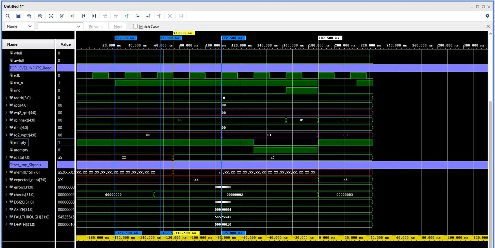
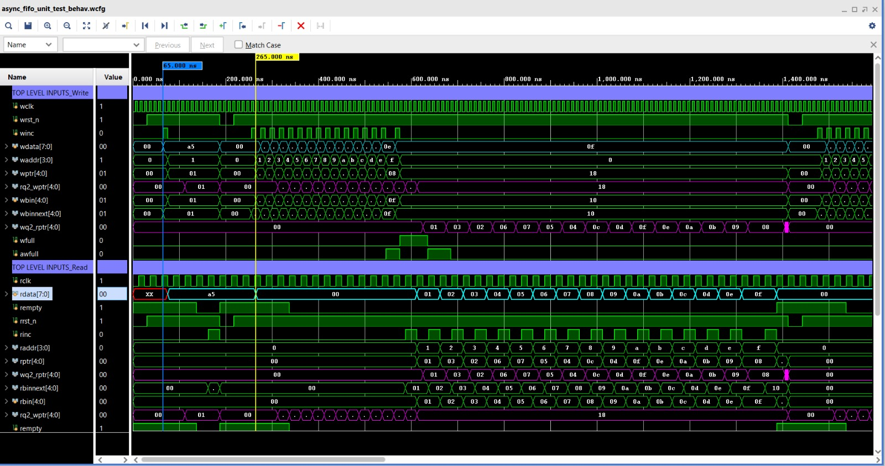
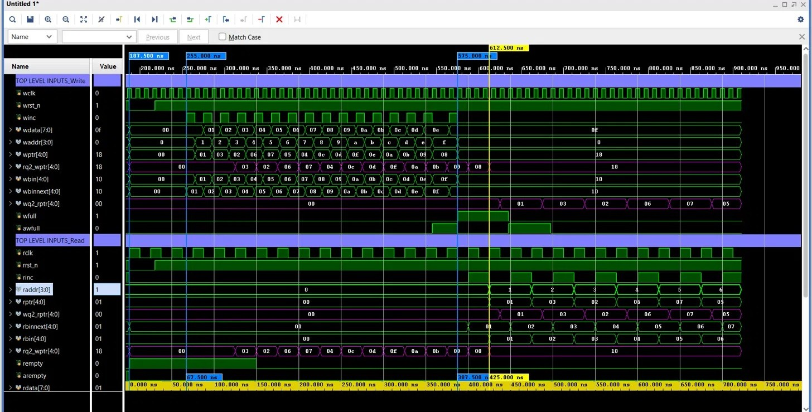
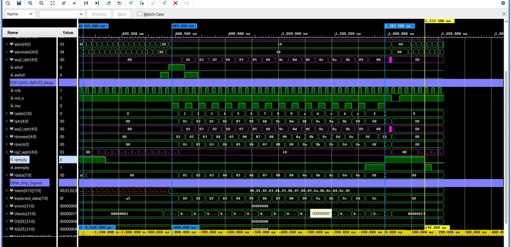
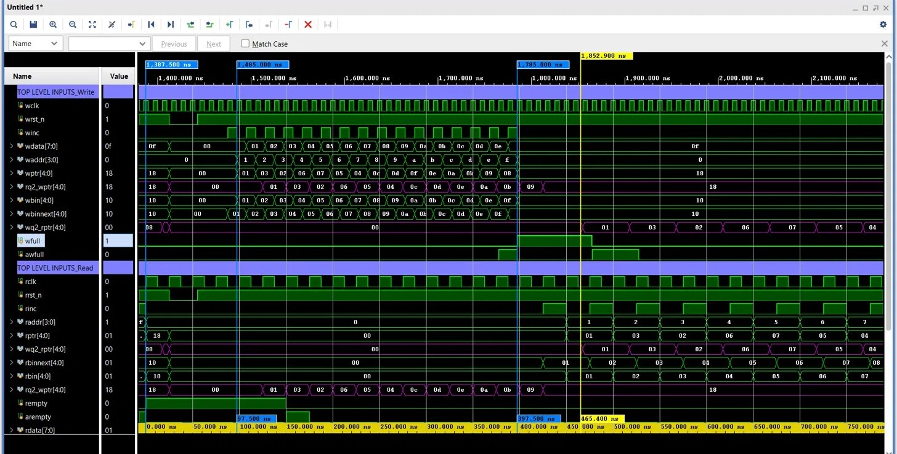
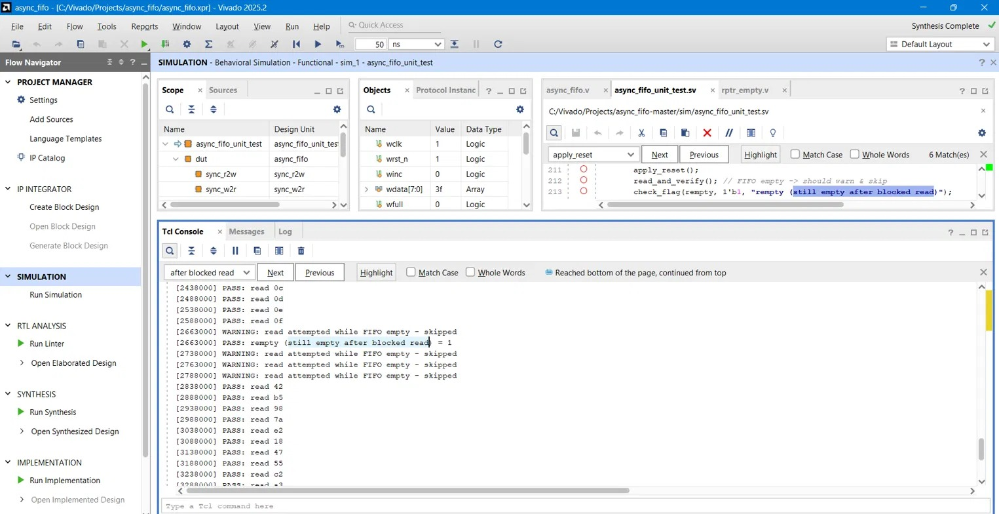
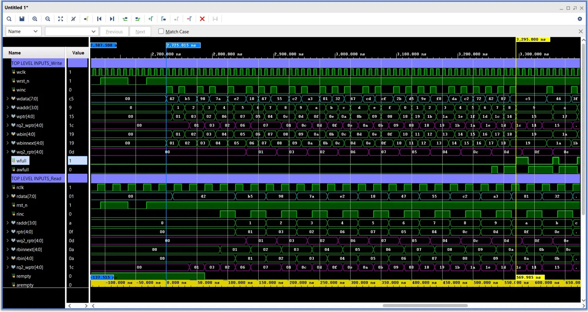
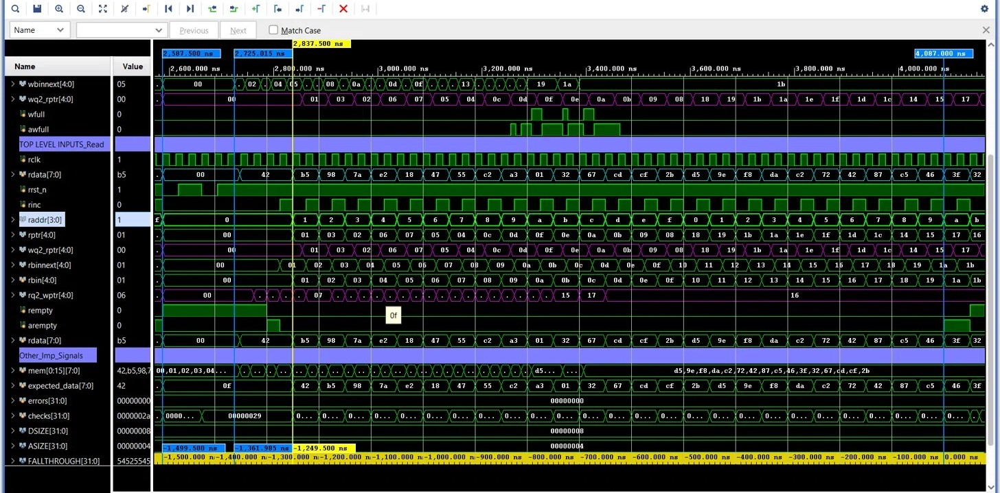
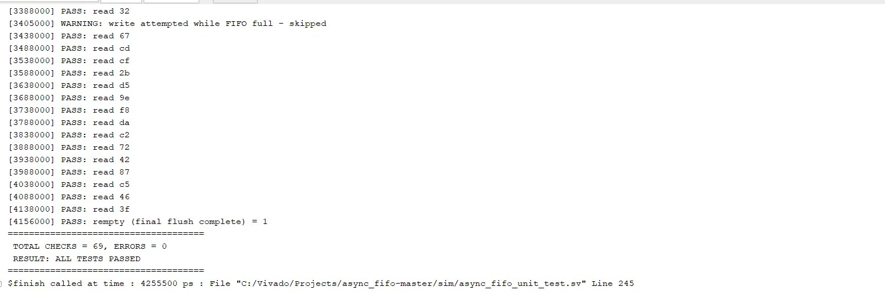

Asynchronous FIFO in SystemVerilog with Self-Checking Verification

Show Image
Show Image
Show Image
Show Image
Show Image
Show Image

A dual-clock asynchronous FIFO implementing the classic Cummings Gray-code pointer architecture for safe Clock Domain Crossing (CDC).

This repository contains:

Parameterized SystemVerilog RTL implementation
Custom self-checking SystemVerilog testbench
Golden queue scoreboard
8 directed and randomized verification test cases
Waveform analysis for every verification scenario
Final verification summary with 69 automated checks and 0 errors

The objective of this project is to understand, verify, and document a CDC-safe asynchronous FIFO architecture commonly used in FPGA and ASIC designs.

Table of Contents

Features
Repository Structure
FIFO Architecture
Clock Domain Crossing (CDC) Theory
RTL Modules
Tools Used
Verification Methodology
Test Cases
Final Result Summary
Acknowledgements
My Contributions
Future Improvements
License

Features

Parameterized FIFO (DSIZE / ASIZE)
Dual-clock asynchronous architecture
Gray-code read/write pointers
2-Flip-Flop CDC synchronizers
First Word Fall Through (FWFT)
Full / Almost Full detection
Empty / Almost Empty detection
Self-checking verification environment
Golden Queue Scoreboard
Randomized CDC stress verification

Repository Structure

async-fifo-verilog/
├── rtl/
│   ├── async_fifo.v         # Top-level FIFO wrapper
│   ├── fifomem.v            # Dual-port memory array
│   ├── wptr_full.v          # Write pointer, Gray counter, full/awfull logic
│   ├── rptr_empty.v         # Read pointer, Gray counter, empty/arempty logic
│   ├── sync_r2w.v           # 2-FF synchronizer: read domain -> write domain
│   └── sync_w2r.v           # 2-FF synchronizer: write domain -> read domain
├── sim/
│   └── async_fifo_unit_test.sv   # Self-checking testbench (this project)
├── doc/
│   └── images/
│       ├── 01_reset.jpeg
│       ├── 02_single_read_write.jpeg
│       ├── 03_fifo_full.jpeg
│       ├── 04_fifo_drain.jpeg
│       ├── 05_overflow_protection.jpeg
│       ├── 06_underflow_protection.jpeg
│       ├── 07_random_stress.jpeg
│       ├── 08_final_flush.jpeg
│       └── 09_final_tcl.jpeg
└── README.md

FIFO Architecture

   Write Domain (wptr_full)      fifomem (dual-port RAM)     Read Domain (rptr_empty)
   wbin/wptr, wfull, awfull  ──►  DEPTH = 2^ASIZE           ◄──  rbin/rptr, rempty, arempty

   wptr ──► sync_w2r ──► rq2_wptr   (used by rptr_empty for the empty decision)
   rptr ──► sync_r2w ──► wq2_rptr   (used by wptr_full for the full decision)

Each side maintains its own binary and Gray-coded pointer. The Gray-coded pointer is passed through a 2-flip-flop synchronizer into the opposite clock domain, where it's compared against the local pointer to generate full/empty. Since only one bit changes per increment, a synchronizer sampling mid-transition can never land more than one count off — making the comparison metastability-safe.

Clock Domain Crossing (CDC) Theory

ConceptWhy it's neededGray-code pointersOnly 1 bit toggles per increment, so a synchronizer sampling mid-transition reads a value at most ±1 off.2-FF synchronizerTwo back-to-back flip-flops reduce the probability of metastability propagating downstream to a negligible level.Full detectionwptr vs synchronized wq2_rptr — full when the write pointer has "lapped" the read pointer (MSBs inverted, rest equal).Empty detectionrptr vs synchronized rq2_wptr — empty when the pointers are equal.Almost-full / almost-emptyEarly-warning flags computed one count ahead of the true boundary, for back-pressure before the hard limit.

Key principle: the full/empty decision is never made against the live pointer from the other domain — only against its synchronized copy. This is what makes the flags safe across independent, unrelated clocks.

RTL Modules

ModuleResponsibilityasync_fifo.vTop-level: instantiates memory, both pointer/flag blocks, and both synchronizers.fifomem.vDual-port RAM. In FWFT mode, rdata is driven combinationally (rdata = mem[raddr]), so valid data appears on the bus before rinc is asserted — the consumer can peek before popping.wptr_full.vGenerates binary + Gray write pointer, drives waddr, computes wfull and awfull.rptr_empty.vGenerates binary + Gray read pointer, drives raddr, computes rempty and arempty.sync_w2r.v2-FF synchronizer moving wptr (Gray) into the read clock domain → rq2_wptr.sync_r2w.v2-FF synchronizer moving rptr (Gray) into the write clock domain → wq2_rptr.

Tools Used

CategoryToolRTL DesignSystemVerilogSimulationAMD Xilinx Vivado Simulator (XSim)DevelopmentVisual Studio CodeVersion ControlGit & GitHub

Verification Methodology

The testbench (sim/async_fifo_unit_test.sv) is a single, self-contained, self-checking file — no svut or other macro library — built to independently re-derive and verify every behavior of the RTL.

Golden-queue scoreboard: every accepted write pushes into a SystemVerilog queue (golden_queue); every accepted read pops from the front and compares against rdata. Any mismatch increments errors; every check increments checks. Final result is printed automatically at end of simulation.

Two independent, unrelated clocks: wclk = 100 MHz (10 ns), rclk = 40 MHz (25 ns).

TaskPurposeapply_reset()Pulses both domain resets, clears golden_queue.write_data(data)Drives a write only if !wfull; otherwise logs a warning and skips.read_and_verify()Drives a read only if !rempty, then compares rdata against the popped golden value.check_flag(actual, expected, name)Generic flag-assertion helper for wfull, rempty, awfull, arempty.

Each test case below builds on this same infrastructure — only the stimulus sequence changes.

Test Cases

Test Case 1 — Reset State

Objective
Verify the FIFO powers up into a clean, well-defined state immediately after reset.

Expected Behavior
wfull = 0 and rempty = 1 right after apply_reset(), with no writes or reads yet issued.

Key Signals Verified: wfull, rempty

Observation
Both flags settle to their reset values with no pointer activity on either side. wbin/rbin and wptr/rptr all remain at 0, confirming a clean, well-defined power-up state before any stimulus is applied.

Result
✅ PASS — wfull = 0, rempty = 1 confirmed after reset.

Test Case 2 — Single Write → Single Read (FWFT Sanity Check)

Objective
Verify the basic write-then-read data path, and confirm First-Word-Fall-Through (FWFT) behavior.

Expected Behavior
After one write of 8'hA5, rdata should reflect A5 as soon as rempty deasserts — before rinc is ever asserted — since FALLTHROUGH = "TRUE" drives rdata combinationally (rdata = mem[raddr]).

Key Signals Verified: wdata, winc, rdata (pre- and post-rinc), rempty

Observation
rdata transitioned from XX to A5 roughly 112 ns before rinc was ever pulsed, as soon as rempty deasserted. This is correct FWFT behavior: rinc only advances raddr/rptr, it does not gate or release rdata. The scoreboard comparison at pop time still matched (A5 == A5).

Result
✅ PASS — single write/read verified; FWFT property confirmed (data valid pre-rinc).

Test Case 3 — Fill to Full (wfull / awfull)

Objective
Verify write-pointer progression and correct assertion timing of awfull and wfull while filling the FIFO to capacity.

Expected Behavior
With DEPTH = 16: awfull should assert exactly after the 15th write (one write remaining), and wfull should assert exactly after the 16th write (completely full).

Key Signals Verified: waddr, wbin, wptr (Gray), awfull, wfull, rq2_wptr (synchronized write pointer, write→read direction)

Observation
15 writes landed at waddr = 0x0 → 0xE, with wptr following the correct Gray sequence. awfull asserted right after the 15th write, one short of full. On the 16th write, wptr reached Gray 18 and wfull asserted at exactly this point, with waddr correctly wrapping 0xF → 0x0. rq2_wptr tracked wptr with the expected ~2-cycle sync latency, while wq2_rptr stayed at 0 since no reads occurred.

Result
✅ PASS — all 16 writes landed correctly; awfull/wfull asserted at exact expected counts (15/16); CDC sync paths behaved as expected.

Test Case 4 — Drain to Empty (rempty / arempty)

Objective
Verify read-pointer progression and correct assertion timing of arempty and rempty while draining a fully-written FIFO.

Expected Behavior
Draining continues from the full state left by Test Case 3. arempty should assert with exactly one entry remaining (after 15 reads), and rempty should assert only after the 16th (final) read.

Key Signals Verified: raddr, rbin, rptr (Gray), arempty, rempty, wq2_rptr (synchronized read pointer, read→write direction), Scoreboard match (expected_data == rdata)

Observation
rdata stepped through 00 → 01 → ... → 0F in exact write order, one value per rinc pulse, with no skips or duplicates. The scoreboard matched at all 16 comparisons, while write-side pointers stayed static. arempty asserted after 15 reads (one entry left), and rempty asserted only after the final read. wq2_rptr tracked rptr with the expected sync delay, while rq2_wptr held constant since no writes occurred.

Result
✅ PASS — all 16 reads returned data in correct order; arempty/rempty asserted at exact expected counts; CDC sync paths behaved as expected.

Test Case 5 — Write-to-Full Protection (Overflow)

Objective
Verify that an extra write attempted while the FIFO is already full is safely rejected, with no data or pointer corruption.

Expected Behavior
After 16 valid writes fill the FIFO (wfull = 1), a 17th write (8'hFF) must be blocked: winc must never pulse, wdata must never be driven with the invalid value, and no pointer may advance.

Key Signals Verified: wfull, winc, wdata (during the blocked attempt), waddr, wbin, wptr (must remain frozen), Post-drain scoreboard integrity

Observation
16 valid writes filled the FIFO, with wfull asserting after the 16th write. On the blocked 17th write, winc was held low and wdata was never assigned 0xFF — confirmed on the waveform, where wdata simply holds 0x0F through the blocked attempt. waddr, wbin, and wptr showed no further transitions. The subsequent drain read back exactly the 16 originally-written values, with 0xFF never appearing on rdata.

Result
✅ PASS — overflow write rejected at both the testbench-interface level and the DUT's internal pointer logic; zero corruption on drain.

Test Case 6 — Read-from-Empty Protection (Underflow)

Objective
Verify that a read attempted on an empty FIFO is safely rejected, with no false pop and no state disturbance — the mirror case of Test Case 5.

Expected Behavior
Immediately after a fresh reset (rempty = 1), a read attempt must be detected and skipped before rinc is ever asserted, and rempty must remain 1 afterward.

Key Signals Verified: rempty, rinc (must never pulse), Console log (no bus activity occurs in this test)

Observation
apply_reset() clears both domains, so this test starts from a genuinely empty FIFO — no pointers move, so there is nothing to observe on the waveform. The evidence lives in the console: read_and_verify() was called with rempty = 1, triggering a WARNING: read attempted while FIFO empty - skipped. rinc was held at 1'b0 throughout, and check_flag(rempty, 1'b1, ...) passed immediately after.

Result
✅ PASS — underflow read rejected before reaching the DUT; rempty remained asserted throughout, confirmed via console log.

Test Case 7 — Concurrent Random Read/Write Stress

Objective
Stress-test the CDC synchronizers and pointer logic under fully randomized, unpredictable traffic on two independent asynchronous clocks — the highest-confidence test in the suite.

Expected Behavior
write_thread and read_thread run concurrently (fork...join), each issuing 30 transactions with independent random inter-transaction delays ($urandom_range). FIFO ordering must hold with zero drops, duplicates, or mismatches despite the unpredictable timing.

Key Signals Verified: wdata vs rdata (random sequence, offset by natural write-then-read gap), waddr/wptr and raddr/rptr continuing correctly past the FIFO depth, Scoreboard match under randomized timing, wfull/arempty transient pulses under bursty traffic

Observation
wdata showed the random write sequence (42, B5, 98, 7A, E2, ...), and rdata showed the exact same sequence, offset by the natural write-then-read gap. No value ever appeared out of order or was skipped despite unpredictable, independently random timing. waddr/raddr and wptr/rptr continued wrapping correctly past the FIFO depth. wfull/arempty occasionally pulsed briefly under bursty timing — expected, not a bug.

Result
✅ PASS — every value written was read back in the same order with zero drops, duplicates, or mismatches under fully randomized concurrent timing.

Test Case 8 — Final Flush After Stress Test

Objective
Drain any entries left over from the randomized Test Case 7 traffic and confirm the FIFO reports fully empty once the golden model is exhausted.

Expected Behavior
while (golden_queue.size() > 0) read_and_verify(); should drain the remaining entries in the exact order they were written, with rempty asserting once the golden model's queue is empty.

Key Signals Verified: rbin/rptr continuing from Test Case 7's stopping point, rdata vs expected_data (golden model), arempty, rempty at final drain

Observation
rbin/rptr climbed steadily from 01 to 1B (hex), matching every remaining entry with no gaps or repeats. rdata tracked the same random sequence seen in Test Case 7, confirming leftover entries were read back in the exact order written despite fully asynchronous timing. expected_data matched rdata at every step, with errors staying at 0. arempty/rempty both asserted once the last entry was popped.

Result
✅ PASS — all remaining entries flushed in correct order with zero mismatches; rempty asserted exactly when expected.

Final Result Summary

MetricResultTotal Checks69Errors0Status✅ ALL TESTS PASSED

#TestWhat It Verifies1Idle statewfull = 0, rempty = 1 immediately after reset2Single write → readBasic write/read path, FWFT data visibility3Fill to fullwptr/waddr progression, awfull/wfull assert at correct counts4Drain to emptyrptr/raddr progression, arempty/rempty assert at correct counts5Write-to-full protectionOverflow write blocked before reaching wdata/winc6Read-from-empty protectionUnderflow read blocked before reaching rinc7Concurrent random stressRandomized read/write timing across independent async clocks8Final flushRemaining stress-test entries drained cleanly; rempty confirms empty

What this confirms:

Functional correctness — FIFO ordering preserved under every access pattern tested, including fully randomized concurrent traffic.
Boundary safety — full/empty conditions detected and enforced correctly; invalid writes/reads are rejected at the interface level, never reaching the DUT as valid pulses.
CDC correctness — both synchronizer paths (wptr → rq2_wptr, rptr → wq2_wptr) show the expected 2-flip-flop latency and never cause a false full/empty decision.
Zero data corruption, drops, or reordering across all 69 checks, including the randomized stress path.

Acknowledgements

The RTL design (async_fifo and its sub-modules) is based on the well-known Cummings-style dual-clock asynchronous FIFO architecture, as implemented in the open-source dpretet/async_fifo repository (MIT License). Full credit for the RTL architecture goes to the original author.
Architectural reference: Clifford E. Cummings, "Simulation and Synthesis Techniques for Asynchronous FIFO Design", SNUG 2002.

My Contributions

Studied and analyzed the complete asynchronous FIFO RTL architecture.
Understood Gray-code pointer synchronization and CDC logic.
Developed a custom self-checking SystemVerilog testbench.
Designed a reusable golden queue scoreboard.
Implemented 8 directed and randomized verification scenarios.
Performed detailed waveform analysis and documented verification results.

Future Improvements

SystemVerilog Assertions (SVA)
Functional Coverage
UVM Verification Environment
FPGA Hardware Validation

License

The RTL implementation in this repository is based on the open-source dpretet/async_fifo project, released under the MIT License.

The custom verification environment, documentation, waveform analysis, and verification notes were developed for this repository.
Contentcase 1 reset 
Verification Note: FWFT (First-Word-Fall-Through) Timing Behavior

Observation made during waveform debug of async_fifo_tb.sv (single write → single read test).

What I noticed

While reviewing the waveform, rdata transitioned from XX to the written value (a5)
~112 ns before ripasted/*
 * Copyright (c) 2026 Divy Thakkar
 *
 * Custom self-checking SystemVerilog testbench developed for
 * verification of an asynchronous FIFO.
 *
 * Features:
 * - Reset verification
 * - Single write/read verification
 * - FIFO full detection
 * - FIFO empty detection
 * - Overflow protpasted